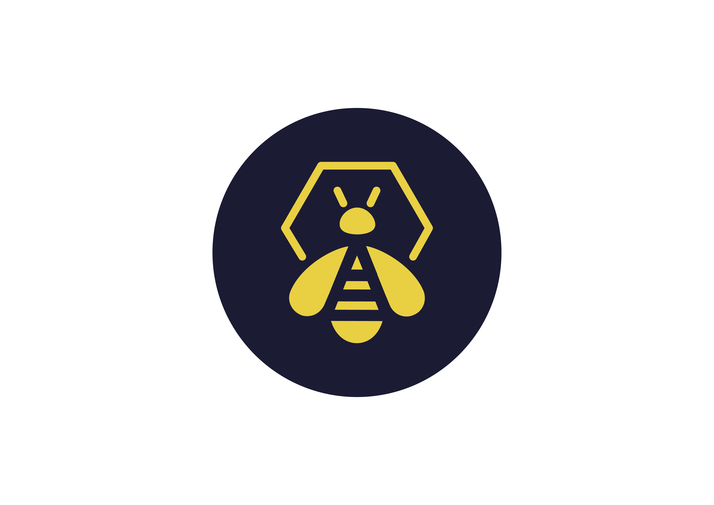

# 🚨 Automated SOC Workflows for Incident Response

This repository contains the implementation of my End-of-Studies project: **Automation of SOC Workflows for Incident Response**, built using open-source technologies.

## Introduction
As cyber threats grow in complexity and volume, Security Operations Center (SOC) face increasing pressure to detect, analyze, and respond to incidents quickly and accurately. This project presents a cloud-based solution that automates key SOC workflows from threat detection to incident response using open-source tools. The goal is to minimize manual intervention, reduce response time, and improve operational efficiency in modern cybersecurity environments.

## 📌 Overview

Cybersecurity incidents are rising, and traditional SOCs struggle with alert fatigue, manual workflows, and human error. This project aims to automate threat detection, enrichment, response, and case management to improve SOC efficiency.

By combining Wazuh (SIEM/XDR), Shuffle (SOAR), and TheHive (case management), the system enables:

- Real-time event monitoring from endpoints.
- Automated detection and alerting.
- IOC enrichment using threat intelligence source.
- Email notification and incident case creation.
- Scalable cloud deployment using DigitalOcean.

## 🧱 Architecture

The following diagram illustrates the architecture of the automated Security Operations Center (SOC) built using Wazuh, Shuffle, and TheHive, all hosted on the cloud.


### Architecture Summary

Here is a summary of the architecture illustrated above:

1. **Send Events**  
   Endpoints with Wazuh agents installed continuously send telemetry data (logs and security events) to the Wazuh Manager over the internet.

2. **Receive Events**  
   The Wazuh Manager, deployed on the cloud, receives and processes these events in real time.

3. **Send Alerts**  
   When predefined detection rules are triggered, Wazuh sends alerts to the Shuffle SOAR platform.

4. **Enrich IOCs**  
   Shuffle enriches the alerts using threat intelligence sources (e.g., VirusTotal), adding context such as IP reputation or hash classifications.

5. **Create Alerts & Cases**  
   Shuffle forwards enriched alerts to TheHive, automatically generating a new case for the incident.

6. **Send Email**  
   Shuffle notifies the SOC analyst via email about the newly created case and detected threat.

7. **Receive Email**  
   The SOC analyst receives the email containing the alert and case details.

8. **Send Response Action**  
   Based on the analysis, the SOC analyst can initiate a response directly from the email, which is sent back to Shuffle.

9. **Send Response Action**  
   Shuffle processes the analyst's decision and sends a response command (e.g., block IP, isolate endpoint) to the Wazuh Manager.

10. **Perform Responsive Actions**  
   Wazuh executes the response on the target endpoint, effectively mitigating the threat.

## ⚙️ Tools & Technologies

<h3>🛠️ Tools & Their Roles</h3>

<table>
  <thead>
    <tr>
      <th>Category</th>
      <th>Tool</th>
      <th>Purpose</th>
    </tr>
  </thead>
  <tbody>
    <tr>
      <td>SIEM + EDR</td>
      <td align="center">
        
      </td>
      <td> Wazuh detects threats and generates alerts</td>
    </tr>
    <tr>
      <td>Case Management</td>
      <td align="center">
        
      </td>
      <td> TheHive platform organizes alerts and manages security cases</td>
    </tr>
    <tr>
      <td>SOAR (Automation)</td>
      <td align="center">
        
      </td>
      <td> Shuffle automate incident response workflows</td>
    </tr>
    <tr>
      <td>Threat Intelligence</td>
      <td align="center">
        
      </td>
      <td> VirusTotal enrich data by checking file hash classification or IP address reputation</td>
    </tr>
  </tbody>
</table>

<details>
<summary><strong>🔎 Understanding the Concepts</strong></summary>

#### 🔹 Wazuh
An open-source security platform that provides threat detection, integrity monitoring, incident response, and compliance. It acts as a SIEM and XDR tool.

#### 🔹 Wazuh Agent
Installed on client machines (Windows/Linux), it collects logs, monitors activity, and sends telemetry to the Wazuh Manager.

#### 🔹 Wazuh Manager
Deployed in a cloud environment, the Wazuh Manager serves as the central component for processing and analyzing logs/security events received from Wazuh agents. It evaluates incoming these events in real time using predefined rules and anomaly detection techniques to spot potential threats. When a suspicious activity is detected, it generates alerts and executes predefined actions to quickly respond to and contain the threat.


#### 🔹 Shuffle
Shuffle acts as the Security Orchestration, Automation, and Response (SOAR) component of our system, streamlining incident response through automation. When it receives alerts from the Wazuh Manager, Shuffle initiates a series of key actions:
- IOC Enrichment: Shuffle utilizes open-source intelligence to enhance the detected indicators of compromise (IOCs), improving threat understanding and analysis.
- Integration with TheHive for Case Management: It automatically creates cases in TheHive for each identified threat, facilitating organized investigations, collaborative response, and detailed incident tracking.
- Email Alerting: Shuffle sends notifications to SOC analysts when new alerts are generated, ensuring swift awareness and prompt reaction to potential threats.
- Automate incident responses.

#### 🔹 TheHive
An incident response and case management system where alerts become structured cases for SOC analysts to investigate and manage.

#### 🔹 Responsive Action
Predefined automated steps like isolating hosts, sending alerts, or blocking malicious IP addresses, executed without human intervention to minimize response time.

</details>

## ⚙️Setting up our Environment

### 🖥️ System Configuration
The table below details our environment, system requirements, and the OS of each equipment.

| **Equipment**                         | **Type**          | **OS**                            | **Configurations**                                                                 
|---------------------------------------|-------------------|-----------------------------------|--------------------------------------------------------------------------------------------------------------
| **Wazuh Manager Server**              | Cloud (DigitalOcean) | Ubuntu Server 22.04 (LTS) x64  | - Memory: 8 GB  <br> - Storage: 160 GB <br> - Processor: 2 cores                    
| **TheHive Server**                    | Cloud (DigitalOcean) | Ubuntu Server 22.04 (LTS) x64  | - Memory: 8 GB  <br> - Storage: 160 GB <br> - Processor: 2 cores    
| **VM1 + Wazuh-Agent**                 | Virtual              | Windows 10                     | - Memory: 4 GB  <br> - Storage: 50 GB <br> - Processor: 1 core                
| **VM2 + Wazuh-Agent**                 | Virtual              | Ubuntu                         | - Memory: 4 GB  <br> - Storage: 50 GB <br> - Processor: 1 core                            
| **Attacker Machine**                  | Virtual              | Kali Linux                     | - Memory: 4 GB  <br> - Storage: 50 GB <br> - Processor: 2 cores               

> ⚠️ **Note:** I won't cover how to create the virtual machines in detail, as it's a standard procedure. We’ll focus instead on configuring Sysmon on the Windows 10 VM.

### ✅ Step-by-Step: Installing Sysmon on Windows 10

1. **Create the Windows 10 Virtual Machine**  
   Use a [Windows 10 ISO](https://www.microsoft.com/en-us/software-download/windows10) in your preferred virtualization software (VirtualBox, VMware, etc.).

2. **Download Sysmon**  
   - Get the latest [Sysmon release](https://learn.microsoft.com/en-us/sysinternals/downloads/sysmon) from the Microsoft Sysinternals website.
   - Download the `sysmonconfig.xml` file from the [Sysmon Modular GitHub repository](https://github.com/olafhartong/sysmon-modular).

3. **Set Up Sysmon**  
   - Extract the `Sysmon.zip` archive to a folder.
   - Move the downloaded `sysmonconfig.xml` into that same folder.

4. **Install Sysmon**  
   Open PowerShell **as Administrator**, navigate to the Sysmon folder, and run the following command:
   ```powershell
   .\Sysmon64.exe -i .\sysmonconfig.xml
    ```
   

   You can verify that Sysmon was installed successfully with:

   - **Services.msc:** Confirm the presence of Sysmon64 as showed below
     
   

## ☁️ In the Cloud (DigitalOcean): Creating Wazuh & TheHive Droplets

To deploy the SOC solution components in the cloud, we'll create two separate Droplets (virtual machines),  one for **Wazuh** and one for **TheHive**, using [DigitalOcean](https://www.digitalocean.com/).

### 🔧 Droplet Configuration

- **Image:** Ubuntu 22.04 (LTS)
- **Plan:** Basic CPU
- **Memory:** 8 GB RAM
- **Storage:** 160 GB SSD
- **Processor:** 2 vCPUs
- **Hostname:** 
  - `Wazuh` for the Wazuh server
  - `TheHive` for the TheHive server
- **Authentication:** Set a strong root password or use SSH keys

### 🔒 Securing Access: Configure a Basic Firewall

Since these Droplets are accessible over the internet via SSH, it's essential to limit exposure to potential threats using DigitalOcean's built-in firewall.

#### 🚧 Steps to Set Up a Firewall:

- Navigate to: Networking > Firewalls
- Create Inbound & Outbound rules to limit Incoming/Outcoming TCP and UDP traffic to your IP address.

  

  

  ##### Apply the Firewall to Your Droplets:
   Select both `Wazuh` and `TheHive` droplets under **"Add Droplets"**.
   


### 🔐 Connect to the Wazuh Server via SSH
Once our Droplets are created and the firewall applied to them, let's try to connect to our Wazuh server via SSH using this command :
````
  ssh root@<YOUR_WAZUH_DROPLET_IP>
````
With SSH access confirmed, let's update our system:

````
sudo apt-get update && sudo apt-get upgrade -y
````
Now we are ready to install and configure Wazuh with the curl command located on the [Wazuh Quickstart Guide](https://documentation.wazuh.com/current/quickstart.html).

````
curl -sO https://packages.wazuh.com/4.7/wazuh-install.sh && sudo bash ./wazuh-install.sh -a
````

After running this command, the installation process will begin. Don't forget to take note of the generated password for the "admin" user:

````
User: admin
Password: *******************
````

#### Access the Wazuh Web Interface:

We can now access the Wazuh Dashboard at https://[Wazuh-Droplet-IP]/ and use the credentials to sign in.


Now we have our client machines and Wazuh server up and running. The next step is to install TheHive on our second droplet.


### 🐝 Install TheHive

We start by installing the necessary dependencies for TheHive: 

````
apt install wget gnupg apt-transport-https git ca-certificates ca-certificates-java curl software-properties-common python3-pip lsb-release
````

<details>

Java Installation

````
wget -qO- https://apt.corretto.aws/corretto.key | sudo gpg --dearmor -o /usr/share/keyrings/corretto.gpg
echo "deb [signed-by=/usr/share/keyrings/corretto.gpg] https://apt.corretto.aws stable main" | sudo tee -a /etc/apt/sources.list.d/corretto.sources.list
sudo apt update
sudo apt install java-common java-11-amazon-corretto-jdk
echo JAVA_HOME="/usr/lib/jvm/java-11-amazon-corretto" | sudo tee -a /etc/environment
export JAVA_HOME="/usr/lib/jvm/java-11-amazon-corretto"
````

Cassandra Installation: Cassandra is the database used by TheHive for storing data.

````
wget -qO - https://downloads.apache.org/cassandra/KEYS | sudo gpg --dearmor -o /usr/share/keyrings/cassandra-archive.gpg
echo "deb [signed-by=/usr/share/keyrings/cassandra-archive.gpg] https://debian.cassandra.apache.org 40x main" | sudo tee -a /etc/apt/sources.list.d/cassandra.sources.list
sudo apt update
sudo apt install cassandra
````

Elasticsearch Installation: Elasticsearch is used by TheHive for indexing and searching data.

````
wget -qO - https://artifacts.elastic.co/GPG-KEY-elasticsearch | sudo gpg --dearmor -o /usr/share/keyrings/elasticsearch-keyring.gpg
sudo apt-get install apt-transport-https
echo "deb [signed-by=/usr/share/keyrings/elasticsearch-keyring.gpg] https://artifacts.elastic.co/packages/7.x/apt stable main" | sudo tee /etc/apt/sources.list.d/elastic-7.x.list
sudo apt update
sudo apt install elasticsearch
````

Limit the ElasticSearch RAM usage (so it doesn't crash!):

- nano /etc/elasticsearch/jvm.options.d/jvm.options
- Paste the following:
````
-Dlog4j2.formatMsgNoLookups=true
-Xms2g
-Xmx2g
````

TheHive Installation:
````
wget -O- https://archives.strangebee.com/keys/strangebee.gpg | sudo gpg --dearmor -o /usr/share/keyrings/strangebee-archive-keyring.gpg
echo 'deb [signed-by=/usr/share/keyrings/strangebee-archive-keyring.gpg] https://deb.strangebee.com thehive-5.2 main' | sudo tee -a /etc/apt/sources.list.d/strangebee.list
sudo apt-get update
sudo apt-get install -y thehive
````

Once TheHive, Cassandra, and Elasticsearch are installed on your droplet, use the following steps to configure each component properly.

Configure Cassandra:
````
Edit the Cassandra configuration file:
1- sudo nano /etc/cassandra/cassandra.yaml
   - Change cluster_name (optional)
   - Change listen_address:, rpc_address:, and under seed_provider: seeds: to TheHive droplet’s public IP
2- systemctl stop cassandra.service
3- rm -rf /var/lib/cassandra/*
4- systemctl start cassandra.service
5- systemctl status cassandra.service

````

Configure ElasticSearch:
````
1- sudo nano /etc/elasticsearch/elasticsearch.yml
   - Uncomment and edit the following:
      - cluster.name: thehive
      - node.name: node-1
      - `network.host: [TheHive droplet’s public IP]
      - http.port: 9200
      - `cluster.initial_master_nodes: [“node-1”]
2- systemctl start elasticsearch
3- systemctl enable elasticsearch
4- systemctl status elasticsearch
````

Configure TheHive:

````
# Set proper permissions
- sudo chown -R thehive:thehive /opt/thp
- ls -la /opt/thp

# Edit application configuration
- sudo nano /etc/thehive/application.conf
   - hostname = ["<TheHive droplet's public IP>"]
   - Set cluster-name to the same as cluster_name in Cassandra earlier.
   - Change application.baseURL = "http://[TheHive droplet's public IP]:9000"

# Start TheHive:
- systemctl start thehive
- systemctl enable thehive
- sudo systemctl status thehive (At this point, all 3 services should be running, which can be checked using systemctl status [service].)
````
</details>

Now we can check out the TheHive dashboard by just going to ``<TheHive droplet's public IP>:9000`` and signing in using the credentials: ``admin@thehive.local:secret``


## ➕ Adding Wazuh Agents


After signing in to the Wazuh web interface, we observe that there are no agents present. Therefore, we need to add agents to our Wazuh manager, as illustrated in the figure above.

 To add an agent to our VMs endpoint, we started by opening Windows PowerShell with administrative privileges and a root terminal. Thereafter, we execute the command retrieved from the Wazuh web application.
 The following figures illustrate how we installed Wazuh agents on our VMs using these commands and started them.

 

 

Give it a bit, and when you refresh the Wazuh dashboard, you’ll see that the agent got installed without a hitch!


## </> Configure Wazuh to ingest Sysmon data

Wazuh works a bit differently from other SIEMs because only the logs that actually trigger a rule show up on the Dashboard, instead of sending all logs over. We need to set up our Wazuh agent to make sure it collects the specific data we want, which in this case is Sysmon. 

Just follow these [steps](https://www.youtube.com/watch?v=amTtlN3uvFU) to get it all sorted out.

## 📋 Create Rules for Wazuh

On the Wazuh dashboard, under Management > Administration > Rules, we can create rules that will trigger when a specific event occurs.

Using a rule from ``0800-sysmon_id_1.xml`` as a template:
   - Select Custom rules > edit local_rules.xml
   - We Added a new rule that will detect if an executed file’s original name was Mimikatz.exe

In this part, we created a custom rule aimed at detecting Mimikatz malware activity. This rule triggers when new processes are produced (from the Sysmon logs with Event ID = 1) and we set a high level of severity to quickly identify attempts to obtain stored credentials from the victim endpoint. By using the technique ``ID=T1003`` for OS credential tampering from MITRE ATT&CK and depending on the ``OriginalFileName`` field rather than generic filenames, our rule remains effective even in instances where attackers may rename malicious files. This strategic method improves the capability to discover advanced malware and enhances the security of the system.

The figure below presents how we edited the ``local rules.xml`` file on the Wazuh manager to add our custom rule for Mimikatz malware.


Now, if we run Mimikatz on our system, a security alert will be created on our dashboard.

## 🤖 Shuffle Automation  

At this point, we need to head over to shuffler.io and set up a Shuffle account. Then we navigated to the Workflows page and created two new workflows named **Mimikatz Workflow** & **SSH Brute-Force Workflow** as shown below.
<details>
   


When the malware is executed on the endpoint, the triggered alert by the Wazuh manager is forwarded via the webhook, and then Shuffle processes it through our workflow steps:
 1. **IoC Extraction:**
     Shuffle uses regular expressions (regex) to extract the SHA-256 hash of the malware from the Wazuh alert.
 2. **VirusTotal Enrichment:**
    The retrieved hash is sent to VirusTotal to obtain its reputation score and further details.
 3. **TheHive Alert Creation:**
    An alert will be generated on TheHive platform automatically.
 4. **TheHive Case Creation:**
    A case is then automatically created and linked to the alert. The hostname, filename, and file hashes have been added to the case as observables for deeper examination.
 5. **Send an Email:** At the end, Shuffle notifies the SOC Analyst by email to prompt him to begin the investigation.


Once an SSH Brute Force alert is received, Shuffle processes it through the following steps:
 1. **IP Extraction:** The IP address of the attacker has been extracted from the alert.
 2. **TheHive Alert Creation:** Shuffle automatically creates a new alert on TheHive and adds the extracted malicious IP as an observable to it.
 3. **VirusTotal Enrichment:** The malicious IP is sent to VirusTotal to obtain its reputation score and its report.
 4. **Send an Email:** Shuffle sends an email to the SOC analyst asking whether to block the malicious IP address or not, and prompts him to start an investigation based on the analysis results of VirusTotal.
 5. **Active Response:** At the end, the workflow can either proceed with an active response to block the attacker’s IP address or not, based on the analyst’s decision.

</details>

If you’re interested in learning how I put these workflows together, [check this out.](https://www.youtube.com/watch?v=GNXK00QapjQ&list=PLG6KGSNK4PuBWmX9NykU0wnWamjxdKhDJ&index=11)

## 🧐 Testing of the automated solution 

For the first demo, we planned to simulate a Mimikatz malware attack on our Windows endpoint to test threat detection and demonstrate the execution of the Shuffle workflow that we created. Initially, we began by installing [Mimikatz](https://github.com/gentilkiwi/mimikatz/releases/tag/2.2.0-20220919)  on our Windows VM. Before executing it and for testing purposes, we renamed the executable malware to ``malwareofnidhal`` to evaluate the efficacity of our custom rule that we made,  as shown in the two figures below.


The Wazuh dashboard shown below clearly shows that our custom rule managed to spot the renamed malware right after it ran.


After enrichment and extraction, our workflow automatically generates an alert in TheHive and creates a linked case, as shown in the following figures.


An automated email alerts SOC analysts to the detected attack, ensuring they’re quickly aware and can respond right away, as shown in the screenshot below.


For the second demo, we planned to simulate an SSH brute-force attack on our Linux endpoint to test threat detection, active response, and demonstrate the Shuffle workflow we created.

The image below shows how we use our Hydra command to launch our attack from the attacker machine. 


I have hidden the target IP, which is our victim machine in this case.


And here, as we can see, the Wazuh dashboard is showing an alert about an IP address that's been behind a lot of failed login attempts.

After enrichment and extraction, our workflow automatically generates an alert in TheHive, as shown in the following figure.


The last part of our workflow, an automated email is sent to the SOC analyst with the analysis results, allowing them to decide whether to block the IP, as shown below.


Once we’ve blocked the IP, let’s double-check to make sure it’s actually blocked on our target machine. We can do this with the iptables command like this:


## 📈 Evaluation Metrics (SOC Metrics & KPIs)

To evaluate our solution's effectiveness, we will assess two key metrics: Mean Time to Detect (MTTD) and Mean Time to Respond (MTTR). These indicators help measure the responsiveness and efficiency of our cybersecurity operations.

- MTTD: represents the average duration that a system takes to recognize an incident from the moment it initiates. It serves as a reflection of the system’s detection capability and speed.
     -  MTTD Formula:

        
        
- MTTR: is a critical metric that represents the average time required for the security team to respond to the detected incident. It highlights the rate at which mitigation actions are activated, either automatically or by a SOC analyst.
     - MTTR Formula:

       

Calculating the MTTD and MTTR helps us see how well the solution performs in real attack scenarios. But I won’t go into the details here because all the data and calculations are already in my report.

## 👋 Conclusion

During this project, I gained practical experience with several key tools utilized in modern security operations, including:
   - Wazuh for log analysis and SIEM
   - Shuffle for automation and SOAR workflows
   - TheHive for case management and incident response

These platforms fit together really well and show just how powerful open-source solutions can be when you integrate them properly. This lab wasn't just about setting up tools, it really helped me see the value of detection, automation, and documentation in real-world security operation.

🔧 Getting your hands dirty with these tools is one of the best ways to level up in cybersecurity theory is good, but nothing beats practice.

## 🧠 Inspiration

This project was inspired by the awesome work of **MyDFIR** on [YouTube](https://www.youtube.com/@MyDFIR). His playlist provided valuable guidance in the setup process and helped me set everything up, big shoutout to him!

For those interested in blue teaming or seeking to enhance their SOC skills, I highly recommend engaging with his projects/labs and exploring the learning paths on [TryHackMe](https://tryhackme.com/paths).


